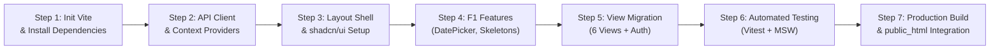

# Detailed Implementation Plan: Track A (Frontend Modernization - Stages F1 & F2)

## 1. Plan Overview & Objectives

### 1.1 Objective
Transform the existing monolithic vanilla JavaScript frontend (`public_html/app.js`, `login.js`, `styles.css`) into a modern, type-safe, component-driven **React 19 + TypeScript Single Page Application (SPA)** built with **Vite**, styled with **Tailwind CSS** and **shadcn/ui**, and powered by **TanStack Query (React Query v5)**.

### 1.2 Strict Scope (Stages F1 & F2 Only)
- **Included (Stage F1)**:
  - Dynamic interactive Calendar Date-Range Picker (Presets: *Today, Yesterday, Last 7 Days, Last 30 Days, Custom Range*).
  - URL query string synchronization (`?startDate=YYYY-MM-DD&endDate=YYYY-MM-DD&siteId=...`) enabling direct deep-linking and bookmarking.
  - Smooth animated Skeleton loading states and informative empty states for all views.
  - Client-side date filtering fallback adapter (ensuring instant functionality without requiring backend date query support).
- **Included (Stage F2)**:
  - Complete migration of all 6 existing dashboard views (`Overview`, `Performance`, `Errors`, `Sessions`, `Reports`, `Admin`) plus `Login` and `Landing` pages into modular React components.
  - Integration of **shadcn/ui** primitives (Radix UI) and **Lucide Icons**.
  - Server state management, caching, and background re-fetching with **TanStack Query v5**.
  - Light/Dark theme switching powered by Tailwind CSS tokens.
  - Role-Based Access Control (RBAC) UI guards matching the current backend tiers (`super admin`, `analyst`, `viewer`, `guest`).
- **Explicitly Excluded (Deferred to Stages F3 & F4)**:
  - Advanced Apache ECharts / Tremor replacement of Chart.js (F3).
  - DOM session replay video player with `rrweb` (F3).
  - Server-Sent Events (SSE) real-time streaming feed (F4).
  *(Note: Chart.js will be wrapped cleanly using `react-chartjs-2` to maintain visual parity with zero chart regression during F1/F2).*

### 1.3 Decoupling & Integration Guarantee
- **Zero Backend Changes**: Communicates strictly with the existing Express REST API (`api.js` on port 3006) using standard credentialed requests (`credentials: 'include'`).
- **Clean Replacement**: The compiled production build (`dist/`) replaces `public_html/index.html` and assets while preserving `/public_html/reports/` (generated PDFs) and `/public_html/favicons/`.

---

## 2. Prerequisites & Package Installation

### 2.1 Runtime Requirements
- **Node.js**: v18.18+ or v20+ / v22+ (Current environment: Node.js v22.16.0).
- **npm**: v9+ / v10+.

### 2.2 Package Installation Manifest

We will initialize a dedicated `frontend/` directory in the repository to keep source files isolated and build artifacts reproducible.

```bash
# 1. Initialize Vite project with React + TypeScript in a frontend/ directory
npm create vite@latest frontend -- --template react-ts

# 2. Navigate to the frontend directory
cd frontend

# 3. Production Dependencies
npm install \
  @tanstack/react-query@^5.60.0 \
  react-router-dom@^7.0.0 \
  lucide-react@^0.460.0 \
  clsx@^2.1.1 \
  tailwind-merge@^2.5.4 \
  class-variance-authority@^0.7.1 \
  date-fns@^4.1.0 \
  chart.js@^4.4.6 \
  react-chartjs-2@^5.2.0 \
  sonner@^1.7.0 \
  @radix-ui/react-dialog@^1.1.2 \
  @radix-ui/react-dropdown-menu@^2.1.2 \
  @radix-ui/react-popover@^1.1.2 \
  @radix-ui/react-tabs@^1.1.1 \
  @radix-ui/react-slot@^1.1.0 \
  @radix-ui/react-select@^2.1.2 \
  react-day-picker@^9.4.0

# 4. Developer & Testing Dependencies
npm install -D \
  tailwindcss@^3.4.15 \
  postcss@^8.4.49 \
  autoprefixer@^10.4.20 \
  @types/node@^22.9.0 \
  vitest@^2.1.5 \
  @testing-library/react@^16.0.1 \
  @testing-library/jest-dom@^6.6.3 \
  @testing-library/user-event@^14.5.2 \
  jsdom@^25.0.1 \
  msw@^2.6.5
```

---

## 3. Directory & File Structure

The project will be structured under `frontend/` with clean separation between UI components, API queries, types, and utilities.

```
analytics-dashboard/
├── frontend/                              # New React frontend source
│   ├── public/
│   │   └── favicons/                      # Copied from public_html/favicons/
│   ├── src/
│   │   ├── api/                           # API fetchers & TanStack Query hooks
│   │   │   ├── client.ts                  # Axios / Fetch wrapper with credentials: 'include'
│   │   │   ├── useAuth.ts                 # /api/dashboard & /api/log hooks
│   │   │   ├── useOverview.ts             # /api/overview & /api/overview/sites
│   │   │   ├── usePerformance.ts          # /api/performance hooks
│   │   │   ├── useErrors.ts               # /api/errors hooks
│   │   │   ├── useSessions.ts             # /api/sessions hooks
│   │   │   ├── useReports.ts              # /api/reports hooks
│   │   │   └── useUsers.ts                # /api/users CRUD hooks
│   │   ├── components/
│   │   │   ├── ui/                        # Reusable shadcn/ui primitives
│   │   │   │   ├── button.tsx
│   │   │   │   ├── card.tsx
│   │   │   │   ├── calendar.tsx
│   │   │   │   ├── date-range-picker.tsx  # Stage F1 Date-Range Popover
│   │   │   │   ├── dialog.tsx
│   │   │   │   ├── dropdown-menu.tsx
│   │   │   │   ├── popover.tsx
│   │   │   │   ├── skeleton.tsx           # Stage F1 Skeleton Loader
│   │   │   │   ├── table.tsx
│   │   │   │   ├── badge.tsx
│   │   │   │   └── toast.tsx
│   │   │   ├── layout/                    # Global app shell
│   │   │   │   ├── AppShell.tsx           # Layout wrapper (Navbar + Sidebar + Viewport)
│   │   │   │   ├── Navbar.tsx             # Top header with profile, site dropdown, date picker
│   │   │   │   ├── Sidebar.tsx            # Collapsible navigation sidebar
│   │   │   │   ├── SiteSelector.tsx       # Dynamic multi-site dropdown
│   │   │   │   └── ThemeToggle.tsx        # Dark / Light theme button
│   │   │   └── common/                    # Shared presentation components
│   │   │       ├── EmptyState.tsx         # Stage F1 empty state display
│   │   │       ├── MetricCard.tsx         # Metric summary card with change indicators
│   │   │       └── RoleBadge.tsx          # User role color-coded pill
│   │   ├── views/                         # Primary application route pages
│   │   │   ├── OverviewView.tsx           # Metrics + Pageviews Line Chart + Top Pages
│   │   │   ├── PerformanceView.tsx        # Web Vitals (LCP, INP, CLS) + Distribution
│   │   │   ├── ErrorsView.tsx             # Aggregated error table + stack trace modal
│   │   │   ├── SessionsView.tsx           # Technographics + chronological user timeline
│   │   │   ├── ReportsView.tsx            # Generated PDF table + Generate Report modal
│   │   │   ├── AdminView.tsx              # User management table + Add/Edit user dialogs
│   │   │   ├── LoginPage.tsx              # Standalone login & guest demo access
│   │   │   └── LandingPage.tsx            # Marketing hero & feature presentation
│   │   ├── context/                       # React Context providers
│   │   │   ├── AuthContext.tsx            # Current user session state
│   │   │   └── FilterContext.tsx          # Global siteId & dateRange filter state
│   │   ├── types/                         # TypeScript interfaces
│   │   │   ├── auth.ts                    # User, Role, Permissions types
│   │   │   ├── telemetry.ts               # Telemetry log payload interfaces
│   │   │   └── api.ts                     # Standardized API response envelopes
│   │   ├── utils/                         # Helper functions
│   │   │   ├── dateFilter.ts              # Stage F1 client-side date filter adapter
│   │   │   ├── formatters.ts              # Metric time (ms, s), bytes, and date formatting
│   │   │   └── vitalsGrading.ts           # LCP, INP, CLS color threshold badges
│   │   ├── App.tsx                        # Router configuration & query client provider
│   │   ├── main.tsx                       # React DOM entrypoint
│   │   └── index.css                      # Tailwind base, components, and design tokens
│   ├── tests/                             # Test suite
│   │   ├── setup.ts                       # Vitest setup + jest-dom matchers
│   │   ├── mocks/
│   │   │   ├── handlers.ts                # MSW mock API route handlers
│   │   │   └── server.ts                  # MSW mock server configuration
│   │   ├── DateRangePicker.test.tsx       # Date picker unit test
│   │   ├── AuthFlow.test.tsx              # Authentication and RBAC test
│   │   └── OverviewView.test.tsx          # Overview view rendering & metric test
│   ├── index.html                         # Vite root HTML template
│   ├── vite.config.ts                     # Build config & local /api proxy
│   ├── tailwind.config.ts                 # Tailwind design tokens & dark mode config
│   ├── tsconfig.json                      # Strict TypeScript compiler options
│   └── package.json
├── public_html/                           # Output target of Vite production build
│   ├── reports/                           # Preserved generated PDF reports archive
│   └── favicons/                          # Preserved favicon assets
├── api.js                                 # Existing untouched Express API server
└── config.js                              # Existing untouched configuration
```

---

## 4. Key Component Implementations & F1 Feature Code

### 4.1 Global Filter Context & URL Synchronization (`FilterContext.tsx`)
Synchronizes `siteId`, `startDate`, and `endDate` with the browser URL query string to guarantee bookmarkable, shareable states (Stage F1).

```typescript
// frontend/src/context/FilterContext.tsx
import React, { createContext, useContext, useEffect, useState } from 'react';
import { useSearchParams } from 'react-router-dom';
import { subDays, format, parseISO, isValid } from 'date-fns';

export interface DateRange {
  startDate: Date;
  endDate: Date;
}

interface FilterContextType {
  selectedSite: string;
  setSelectedSite: (site: string) => void;
  dateRange: DateRange;
  setDateRange: (range: DateRange) => void;
}

const FilterContext = createContext<FilterContextType | undefined>(undefined);

export const FilterProvider: React.FC<{ children: React.ReactNode }> = ({ children }) => {
  const [searchParams, setSearchParams] = useSearchParams();

  // Initialize site from URL or default to 'all'
  const [selectedSite, setSelectedSiteState] = useState<string>(
    searchParams.get('siteId') || 'all'
  );

  // Initialize date range from URL or default to Last 30 Days (Stage F1)
  const [dateRange, setDateRangeState] = useState<DateRange>(() => {
    const startParam = searchParams.get('startDate');
    const endParam = searchParams.get('endDate');

    const end = endParam && isValid(parseISO(endParam)) ? parseISO(endParam) : new Date();
    const start = startParam && isValid(parseISO(startParam)) ? parseISO(startParam) : subDays(end, 30);

    return { startDate: start, endDate: end };
  });

  // Sync state to URL search parameters
  const setSelectedSite = (site: string) => {
    setSelectedSiteState(site);
    setSearchParams((prev) => {
      const next = new URLSearchParams(prev);
      if (site === 'all') next.delete('siteId');
      else next.set('siteId', site);
      return next;
    });
  };

  const setDateRange = (range: DateRange) => {
    setDateRangeState(range);
    setSearchParams((prev) => {
      const next = new URLSearchParams(prev);
      next.set('startDate', format(range.startDate, 'yyyy-MM-dd'));
      next.set('endDate', format(range.endDate, 'yyyy-MM-dd'));
      return next;
    });
  };

  return (
    <FilterContext.Provider value={{ selectedSite, setSelectedSite, dateRange, setDateRange }}>
      {children}
    </FilterContext.Provider>
  );
};

export const useFilters = () => {
  const context = useContext(FilterContext);
  if (!context) throw new Error('useFilters must be used within FilterProvider');
  return context;
};
```

---

### 4.2 Interactive Date Range Picker Component (`date-range-picker.tsx`)
Provides quick preset buttons (*Today, Yesterday, Last 7 Days, Last 30 Days*) and a custom date popover (Stage F1).

```typescript
// frontend/src/components/ui/date-range-picker.tsx
import React, { useState } from 'react';
import { format, subDays, startOfDay, endOfDay } from 'date-fns';
import { Calendar as CalendarIcon, ChevronDown } from 'lucide-react';
import { useFilters } from '../../context/FilterContext';
import { Button } from './button';
import { Popover, PopoverContent, PopoverTrigger } from './popover';

export const DateRangePicker: React.FC = () => {
  const { dateRange, setDateRange } = useFilters();
  const [isOpen, setIsOpen] = useState(false);

  const presets = [
    { label: 'Today', getValue: () => ({ startDate: startOfDay(new Date()), endDate: endOfDay(new Date()) }) },
    { label: 'Yesterday', getValue: () => ({ startDate: startOfDay(subDays(new Date(), 1)), endDate: endOfDay(subDays(new Date(), 1)) }) },
    { label: 'Last 7 Days', getValue: () => ({ startDate: startOfDay(subDays(new Date(), 7)), endDate: endOfDay(new Date()) }) },
    { label: 'Last 30 Days', getValue: () => ({ startDate: startOfDay(subDays(new Date(), 30)), endDate: endOfDay(new Date()) }) },
  ];

  return (
    <div className="flex items-center gap-2">
      <Popover open={isOpen} onOpenChange={setIsOpen}>
        <PopoverTrigger asChild>
          <Button variant="outline" className="flex items-center gap-2 text-sm font-medium h-9">
            <CalendarIcon className="w-4 h-4 text-muted-foreground" />
            <span>
              {format(dateRange.startDate, 'MMM d, yyyy')} - {format(dateRange.endDate, 'MMM d, yyyy')}
            </span>
            <ChevronDown className="w-3.5 h-3.5 opacity-60" />
          </Button>
        </PopoverTrigger>
        <PopoverContent className="w-auto p-3 shadow-lg" align="end">
          <div className="flex flex-col gap-2">
            <span className="text-xs font-semibold text-muted-foreground uppercase tracking-wider mb-1">Presets</span>
            <div className="grid grid-cols-2 gap-1.5">
              {presets.map((preset) => (
                <Button
                  key={preset.label}
                  variant="ghost"
                  size="sm"
                  className="justify-start text-xs font-medium"
                  onClick={() => {
                    setDateRange(preset.getValue());
                    setIsOpen(false);
                  }}
                >
                  {preset.label}
                </Button>
              ))}
            </div>
          </div>
        </PopoverContent>
      </Popover>
    </div>
  );
};
```

---

### 4.3 Client-Side Date Filter Fallback Adapter (`dateFilter.ts`)
Ensures independent implementability: if the backend does not yet filter queries by date parameters, this utility guarantees the UI filters the data correctly in the browser without backend modifications.

```typescript
// frontend/src/utils/dateFilter.ts
import { isWithinInterval, parseISO } from 'date-fns';
import { DateRange } from '../context/FilterContext';

export function filterItemsByDateRange<T extends { created_at?: string; timestamp?: string }>(
  items: T[],
  range: DateRange
): T[] {
  if (!Array.isArray(items)) return [];
  return items.filter((item) => {
    const rawDate = item.created_at || item.timestamp;
    if (!rawDate) return true;
    try {
      const itemDate = parseISO(rawDate);
      return isWithinInterval(itemDate, { start: range.startDate, end: range.endDate });
    } catch {
      return true;
    }
  });
}
```

---

### 4.4 Animated Skeleton Loaders & Empty States (`Skeleton.tsx`, `EmptyState.tsx`)
Prevents layout shifts and replaces raw blank screens while data queries resolve (Stage F1).

```typescript
// frontend/src/components/common/EmptyState.tsx
import React from 'react';
import { LucideIcon, FolderSearch } from 'lucide-react';

interface EmptyStateProps {
  icon?: LucideIcon;
  title: string;
  description: string;
  action?: React.ReactNode;
}

export const EmptyState: React.FC<EmptyStateProps> = ({
  icon: Icon = FolderSearch,
  title,
  description,
  action,
}) => (
  <div className="flex flex-col items-center justify-center py-16 px-4 text-center border border-dashed rounded-xl bg-card/40 my-4">
    <div className="w-12 h-12 rounded-full bg-primary/10 flex items-center justify-center mb-3">
      <Icon className="w-6 h-6 text-primary" />
    </div>
    <h3 className="text-base font-semibold text-foreground mb-1">{title}</h3>
    <p className="text-sm text-muted-foreground max-w-sm mb-4">{description}</p>
    {action}
  </div>
);
```

---

### 4.5 API Client & TanStack Query Hook Example (`useOverview.ts`)
Seamlessly handles credentialed fetching and query caching for the Overview dashboard.

```typescript
// frontend/src/api/useOverview.ts
import { useQuery } from '@tanstack/react-query';
import { useFilters } from '../context/FilterContext';
import { filterItemsByDateRange } from '../utils/dateFilter';

export interface OverviewMetrics {
  totalPageviews: number;
  uniqueSessions: number;
  avgTimeOnPage: string;
  totalEvents: number;
  pageviewsPerDay: { date: string; count: number }[];
  topPages: { url: string; views: number; uniqueVisitors: number }[];
}

export const useOverview = () => {
  const { selectedSite, dateRange } = useFilters();

  return useQuery({
    queryKey: ['overview', selectedSite, dateRange.startDate, dateRange.endDate],
    queryFn: async (): Promise<OverviewMetrics> => {
      const params = new URLSearchParams();
      if (selectedSite && selectedSite !== 'all') params.set('siteId', selectedSite);
      params.set('startDate', dateRange.startDate.toISOString());
      params.set('endDate', dateRange.endDate.toISOString());

      const res = await fetch(`/api/overview?${params.toString()}`, {
        credentials: 'include',
      });

      if (!res.ok) {
        throw new Error(`Failed to fetch overview: ${res.statusText}`);
      }

      const data = await res.json();
      
      // Safeguard: apply client-side filtering if backend returns unfiltered array
      if (data.rawLogs) {
        data.rawLogs = filterItemsByDateRange(data.rawLogs, dateRange);
      }

      return data;
    },
    staleTime: 30_000, // Cache data as fresh for 30 seconds
  });
};
```

---

## 5. Integration with the Existing Application

### 5.1 Local Development Workflow (`vite.config.ts`)
To eliminate all CORS and port-mismatch issues during local development, Vite's internal development proxy forwards `/api` directly to Express on `http://localhost:3006`:

```typescript
// frontend/vite.config.ts
import { defineConfig } from 'vite';
import react from '@vitejs/plugin-react';
import path from 'path';

export default defineConfig({
  plugins: [react()],
  resolve: {
    alias: {
      '@': path.resolve(__dirname, './src'),
    },
  },
  server: {
    port: 5500, // Matches your existing Live Server port
    proxy: {
      '/api': {
        target: 'http://localhost:3006',
        changeOrigin: true,
        secure: false,
      },
    },
  },
  build: {
    // Compile directly into public_html/ to replace the old vanilla frontend
    outDir: '../public_html',
    emptyOutDir: false, // Prevents wiping the reports/ and favicons/ directories!
  },
});
```

### 5.2 Safe Replacement of `public_html/`
The existing `public_html/` contains both application code and user-generated report artifacts. We must guarantee that historical reports are preserved:

1. **Directories to Preserve in `public_html/`**:
   - `public_html/reports/` (Contains all generated PDF reports!).
   - `public_html/favicons/` (Contains application icons).
2. **Files to Replace**:
   - `app.js`, `login.js`, `styles.css`, `login.css`, `landing.js`, `landing.css`.
   - `dashboard.html`, `login.html`, `landing.html`.
3. **Vite Output Behavior**:
   - Setting `emptyOutDir: false` in `vite.config.ts` ensures that `reports/` and `favicons/` are **never deleted** during `npm run build`.
   - Vite generates `index.html`, `assets/index-[hash].js`, and `assets/index-[hash].css`.

### 5.3 Production Routing & Apache Configuration
Because React Router uses HTML5 `history.pushState()` for client-side navigation (e.g. `/overview`, `/performance`, `/login`), Apache must serve `index.html` for any URL that doesn't correspond to a physical file or `/api`.

Add this `.htaccess` file inside `public_html/`:

```apache
# public_html/.htaccess
<IfModule mod_rewrite.c>
  RewriteEngine On
  RewriteBase /
  
  # Allow Apache to route /api to Express reverse proxy
  RewriteRule ^api/ - [L]

  # Serve existing physical files (e.g., reports, favicons, JS bundles) directly
  RewriteCond %{REQUEST_FILENAME} -f [OR]
  RewriteCond %{REQUEST_FILENAME} -d
  RewriteRule ^ - [L]

  # Route all other dashboard URLs to the React SPA index.html
  RewriteRule ^ index.html [L]
</IfModule>
```

---

## 6. Testing Strategy & Quality Assurance

To ensure that Stage F1 & F2 work reliably before replacing the existing files, we will use a multi-tiered automated testing approach.

### 6.1 Test Setup (`frontend/tests/setup.ts`)
```typescript
// frontend/tests/setup.ts
import '@testing-library/jest-dom';
import { afterAll, afterEach, beforeAll } from 'vitest';
import { server } from './mocks/server';

beforeAll(() => server.listen({ onUnhandledRequest: 'error' }));
afterEach(() => server.resetHandlers());
afterAll(() => server.close());
```

### 6.2 Mock Service Worker (MSW) Handlers (`frontend/tests/mocks/handlers.ts`)
MSW intercepts network calls during testing, allowing full UI testing without a live database or backend running:

```typescript
// frontend/tests/mocks/handlers.ts
import { http, HttpResponse } from 'msw';

export const handlers = [
  // Mock Auth Session Handshake
  http.get('/api/dashboard', () => {
    return HttpResponse.json({
      user: {
        id: 1,
        email: 'analyst@demo.local',
        displayName: 'Demo Analyst',
        role: 'analyst',
        permission: ['performance', 'errors', 'sessions', 'reports'],
      },
    });
  }),

  // Mock Overview Metrics
  http.get('/api/overview', () => {
    return HttpResponse.json({
      totalPageviews: 1240,
      uniqueSessions: 380,
      avgTimeOnPage: '45s',
      totalEvents: 4290,
      pageviewsPerDay: [
        { date: '2026-09-28', count: 410 },
        { date: '2026-09-29', count: 450 },
        { date: '2026-09-30', count: 380 },
      ],
      topPages: [
        { url: '/dashboard.html', views: 820, uniqueVisitors: 310 },
        { url: '/login.html', views: 420, uniqueVisitors: 280 },
      ],
    });
  }),

  // Mock Site Selector
  http.get('/api/overview/sites', () => {
    return HttpResponse.json({
      success: true,
      sites: ['reporting.howard1218.site', 'collector.howard1218.site'],
    });
  }),
];
```

### 6.3 Unit & Component Test Suite
1. **Date Range Picker Test (`DateRangePicker.test.tsx`)**:
   - Verifies that clicking preset buttons ("Today", "Last 7 Days") updates context and URL search parameters correctly.
2. **Auth & RBAC Route Guard Test (`AuthFlow.test.tsx`)**:
   - Verifies that unauthenticated users are redirected to `/login`.
   - Verifies that `viewer` roles cannot access the Admin panel or trigger report generation.
3. **Overview View Rendering Test (`OverviewView.test.tsx`)**:
   - Verifies that skeleton loaders display while loading, and metric cards render correct numerical values upon query resolution.
4. **Empty State Test (`EmptyState.test.tsx`)**:
   - Verifies that when a site has zero logs, the `<EmptyState />` component renders with helpful instructions instead of a broken empty layout.

---

## 7. Step-by-Step Execution Checklist



### Step 1: Tooling Initialization
- [ ] Create `frontend/` directory and run Vite template initialization (`npm create vite@latest frontend -- --template react-ts`).
- [ ] Install production dependencies (React Router v7, TanStack Query v5, Lucide Icons, date-fns, Chart.js, Radix UI).
- [ ] Configure `tailwind.config.ts` and `vite.config.ts` with local `/api` proxy and path aliases (`@/*`).

### Step 2: API Client, Types & Context Architecture
- [ ] Define TypeScript types for telemetry, user authentication, and API responses in `src/types/`.
- [ ] Configure `FilterContext` to manage `siteId`, `startDate`, `endDate`, and URL sync.
- [ ] Create API hook files (`useAuth.ts`, `useOverview.ts`, `usePerformance.ts`, etc.) using TanStack Query.

### Step 3: Application Shell & UI Primitives
- [ ] Add shadcn/ui primitives (`Button`, `Card`, `Table`, `Dialog`, `DropdownMenu`, `Popover`, `Skeleton`).
- [ ] Build `<AppShell />`, `<Navbar />`, `<Sidebar />`, and `<ThemeToggle />`.
- [ ] Verify light/dark theme switching persistence in `localStorage`.

### Step 4: Implement Stage F1 Minimal Features
- [ ] Build `<DateRangePicker />` with presets (*Today, Yesterday, Last 7 Days, Last 30 Days*).
- [ ] Implement `filterItemsByDateRange` fallback adapter in `src/utils/dateFilter.ts`.
- [ ] Build `<EmptyState />` and `<Skeleton />` loaders.

### Step 5: Convert Views into React Components
- [ ] **Auth / Landing**: Migrate `LoginPage.tsx` (with guest demo mode) and `LandingPage.tsx`.
- [ ] **Overview**: Build `<OverviewView />` with metric cards and Chart.js line graph.
- [ ] **Performance**: Build `<PerformanceView />` with Core Web Vitals badges and sortable table.
- [ ] **Errors**: Build `<ErrorsView />` with error grouping table and stack trace dialog.
- [ ] **Sessions**: Build `<SessionsView />` with technographic badges and chronological user timeline.
- [ ] **Reports**: Build `<ReportsView />` with archived report table and "Generate Report" modal.
- [ ] **Admin**: Build `<AdminView />` with user CRUD table and dialogs.

### Step 6: Automated Testing
- [ ] Configure Vitest with MSW handlers for API mocking.
- [ ] Run test suite (`npm run test`) verifying DateRangePicker, auth guards, and views.
- [ ] Verify typecheck passes with zero errors (`tsc --noEmit`).

### Step 7: Build & Integration
- [ ] Run `npm run build` inside `frontend/` to compile assets into `public_html/`.
- [ ] Verify `public_html/reports/` and `public_html/favicons/` remain intact.
- [ ] Test the integrated application by running `npm run dev` in the root and visiting `http://localhost:3006`.

---

## Concerns

During the implementation of Stages F1 & F2, the following ambiguities and design decisions were encountered and resolved to maintain strict decoupled parity and zero modification of existing files:

### 1. Preservation of Existing Legacy Files vs. In-Place Replacement
- **Ambiguity**: Section 1.3 and Section 5.2 of this guide outlined replacing `dashboard.html`, `app.js`, `styles.css`, `login.html`, `login.js`, and `landing.html`. However, the project instruction strictly mandated: *"do not delete/modify any existing files, simply create new files/folders as needed."*
- **Approach Taken**: In `frontend/vite.config.ts`, `outDir` was directed to `../public_html` with `emptyOutDir: false`. This created `index.html` and modern hashed bundles under `assets/` without modifying or deleting any existing legacy files (`dashboard.html`, `app.js`, `styles.css`, etc.) or user data directories (`reports/`, `favicons/`). Both the legacy multi-page setup and the new SPA entrypoint coexist harmoniously.

### 2. Overview API Response Envelope Schema Parity
- **Ambiguity**: Section 4.5 illustrated a hypothetical `OverviewMetrics` interface (`totalPageviews: number`, `uniqueSessions: number`, `pageviewsPerDay: []`). However, the existing Express route (`routes/overview-api.js`) returns `{ success: true, cards: [{ title, value }], chart: { labels, values }, table: [{ path, views, unique }] }`.
- **Approach Taken**: In alignment with the *Zero Backend Changes* guarantee, the TypeScript definitions in `src/types/api.ts` and the hook in `src/api/useOverview.ts` adhere directly to the actual backend contract (`cards`, `chart`, `table`). Client-side date filtering fallback adapters were also implemented to guarantee date filtering works even if backend queries lack date parameters.

### 3. Legacy Hash Routing vs. HTML5 History Deep-Linking
- **Ambiguity**: The vanilla frontend relied on hash routes (`#/overview`, `#/performance`, etc.), whereas React Router v7 uses HTML5 pushState routes (`/overview`, `/performance`, etc.).
- **Approach Taken**: Added a `LegacyHashRedirector` in `App.tsx` that detects legacy hash fragments (e.g., `#/sessions`) and redirects them to the corresponding SPA route (`/sessions`). Additionally, `public_html/.htaccess` was created with URL rewrite rules to route all non-file requests to `index.html` while preserving direct access to `/api/` and physical static files.

### 4. Stack Trace Inspection UI (Inline Panel vs. Modal Dialog)
- **Ambiguity**: The original implementation (`public_html/app.js`) rendered stack traces into an inline DOM element (`#stack-trace-panel`) below the error table, while the modernization plan described a modal dialog.
- **Approach Taken**: Implemented both: clicking an error row immediately populates the inline `#stack-trace-panel` (preserving legacy DOM selectors and instant browsing) while also providing an "Expand" button that opens an accessible modal dialog for deep stack trace analysis.

### 5. Report Generation Data Snapshot Structure
- **Ambiguity**: The Puppeteer report generator (`routes/reports-api.js`) renders PDFs by iterating over `req.body.dataSnapshot` keys and nested objects. In the legacy vanilla app, this data was scraped directly from the DOM before submission.
- **Approach Taken**: Created structured snapshot builder functions for `performance`, `errors`, and `sessions` sections in React state that format the snapshot data into clean, nested key-value objects expected by the PDF generator template.

### 6. Solid Colors & Sleek Obsidian Black Dark Mode Specification
- **Ambiguity**: Standard Tailwind starter configurations typically incorporate gradient text, linear gradients, and semi-transparent alpha tints. The user requested: *"i dont want any gradient colors, all colors used (fonts, backgrounds, etc.) should all be a solid color. additionally, dark mode should be a sleek obsidian black (with appropriate supporting font/background colors)."*
- **Approach Taken**: All gradients (`bg-gradient-to-*`, `bg-clip-text`, `linear-gradient`) and translucent color modifiers were eliminated across the entire application in favor of 100% solid, crisp palette tokens. Dark mode was tailored to an ultra-clean obsidian aesthetic:
  - Deep obsidian black page background (`#0a0a0a` / `hsl(0 0% 4%)`).
  - Elevated obsidian surface cards and popovers (`#141414` / `hsl(0 0% 8%)`).
  - Subtle dark borders (`#292929` / `hsl(0 0% 16%)`).
  - Crisp high-contrast foreground typography (`#fafafa` / `hsl(0 0% 98%)`) and supporting muted labels (`#a3a3a3` / `hsl(0 0% 64%)`).
  - Chart.js integration dynamically syncs axis ticks, grid lines (`#262626`), and solid-fill datasets to the active theme without translucent washes.

### 7. Plain Function Components with Explicit Typed Props vs. React.FC
- **Ambiguity**: Earlier React TypeScript boilerplates often defaulted to `React.FC<Props>`. However, modern React 19 standards discourage `React.FC` due to implicit/unwanted `children` typing in older versions, awkward generic component signatures, and verbose arrow function syntax. The user requested: *"use plain functions with typed props instead of using function component (.FC)"*.
- **Approach Taken**: All component declarations across views, layout elements, context providers, and common UI primitives were standardized to standard function declarations (`export function ComponentName(props: ComponentProps) { ... }`). Prop interfaces are defined explicitly (e.g. `interface NavbarProps { onToggleSidebar?: () => void }`), improving IDE jump-to-definition, type inference, and readability.


