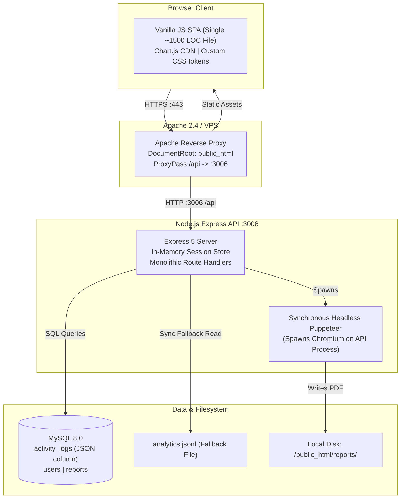
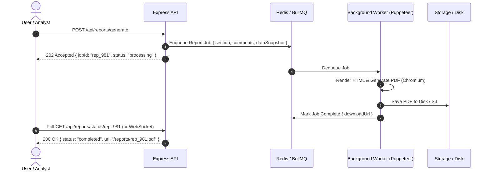
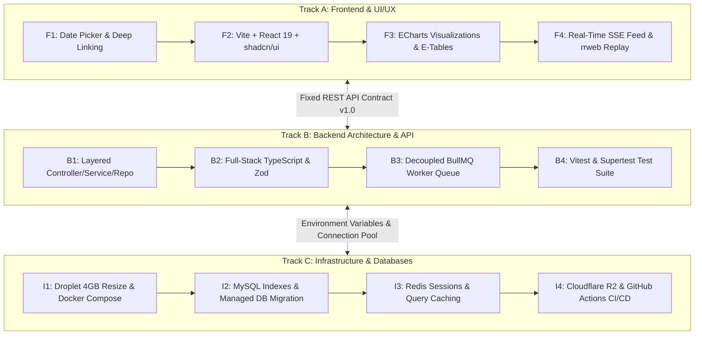

# Modernization & Futureproofing Proposal: Analytics Dashboard

## 1. Executive Summary & Application Baseline Analysis

This document provides a comprehensive technical proposal to modernize, scale, and futureproof the `analytics-dashboard` platform. It builds upon the architecture, capabilities, and design decisions detailed in `analytics_dashboard_summary.md`.

### 1.1 Current Architecture & Tech Stack Summary
- **Domain**: Self-hosted web telemetry, real-time application monitoring, Core Web Vitals profiling, user session reconstruction, and automated PDF reporting.
- **Backend**: Node.js (CommonJS), Express.js (v5.2.1), `mysql2/promise` (connection pooling), `express-session` (in-memory cookie session store), `bcrypt` (password hashing), `puppeteer` (headless Chromium HTML-to-PDF rendering), `cors`, `dotenv`.
- **Frontend**: Vanilla JavaScript SPA (ES6+) with custom hash-based client routing (`#/overview`, `#/performance`, `#/errors`, `#/sessions`, `#/reports`, `#/admin`), Chart.js (v4.x loaded via CDN), semantic HTML5, and custom responsive CSS3 with CSS design tokens.
- **Database & Storage**: MySQL with a hybrid approach: relational tables (`users`, `reports`) alongside a semi-structured table (`activity_logs`) with a flexible `payload` JSON column. Local filesystem fallback reading newline-delimited JSON (`analytics.jsonl`) when database is unavailable.
- **Infrastructure**: Single-node Ubuntu Linux VPS (1 vCPU, 2GB RAM), Apache 2.4 reverse-proxy (`ProxyPass /api http://127.0.0.1:3006/api`), PM2 process manager with memory capping (`--max-old-space-size=300`), loopback proxy trust.



---

### 1.2 Core Strengths of the Current System
1. **Zero-Framework Frontend**: No heavy node module bundles, no compile steps, near-instant initial page loads, and zero frontend build tooling friction.
2. **First-Party Telemetry Ownership**: Privacy-preserving, ad-blocker resistant data collection that complies with strict privacy regulations (GDPR/CCPA).
3. **Deep Observability**: Bridges high-level traffic metrics (pageviews, visitor sessions) with deep engineering observability (Core Web Vitals LCP/INP/CLS, call stack captures, technographics).
4. **Resilient Ingestion vs Reporting Decoupling**: Separation of the collector (port 3005) from reporting (port 3006) preserves ingestion throughput under heavy dashboard queries.

---

### 1.3 Key Bottlenecks, Risks & Technical Debt

| Area | Current Implementation | Risk / Technical Debt | Impact |
|---|---|---|---|
| **Data Layer & Scaling** | In-memory filtering of full table scans (`SELECT * FROM activity_logs`) in Node.js CPU | As logs scale from thousands to millions, Node.js memory (`--max-old-space-size=300`) will suffer Out-Of-Memory (OOM) crashes. Event loop freezes while parsing JSON strings. | High (System crashes under production traffic) |
| **Frontend Codebase** | Monolithic `app.js` (~1500 LOC) and `login.js` using raw template strings and manual DOM mutations | Difficult to maintain, prone to XSS vulnerabilities if user-generated inputs are interpolated into `.innerHTML`, lack of reusable component hierarchy. | High (Maintainability & Security) |
| **Type Safety & Contracts** | Untyped JavaScript across both frontend and backend | No compile-time guarantees on telemetry payloads or API response structures; runtime `TypeError: undefined` bugs. | Medium |
| **Session Management** | Default `MemoryStore` in `express-session` | Sessions are stored in process RAM. When PM2 restarts the process or during multi-instance clustering, all active users are logged out. | Medium |
| **PDF Reporting** | Synchronous Puppeteer Chromium launch directly inside the API process | Spawning Chromium consumes 150MB–300MB RAM per report, threatening server stability on 1 vCPU instances. | High |
| **Developer Experience (DX)** | No build tooling, no automated tests, no Docker environment, manual VPS git deployment | Testing requires manual browser clicking; environment differences (paths, ports, DB access) cause friction. | Medium |

---

## 2. Modernization & Futureproofing Proposals

Below is the structured proposal divided into four pillars:
1. **Frontend & UI/UX Modernization**
2. **Backend Architecture & Type Safety**
3. **Data Layer, Analytics Storage & Caching**
4. **Infrastructure, DX & Operations**

---

### Pillar 1: Frontend & UI/UX Modernization

#### 1.1 Transition to Modern Component Framework (React 19 + Vite or Next.js)
- **Why**: The current frontend relies on `app.js` (~1500 lines) where UI views, routing, chart bindings, modal logic, and DOM rendering are tightly coupled in string templates. Updating one view risks breaking others.
- **How**: 
  - Adopt **Vite + React 19** (or Next.js App Router if SSR/static pre-rendering is desired).
  - Decompose the monolith into modular, reusable components: `<OverviewView />`, `<WebVitalsTable />`, `<SessionTimeline />`, `<ReportModal />`.
  - State management using **TanStack Query (React Query)**: Handles automatic caching, background refetching, query invalidation, and loading/error states without manual `fetch()` boilerplate.

#### 1.2 Modern Design System: Tailwind CSS + shadcn/ui + Lucide Icons
- **Why**: Currently, `styles.css` is ~1200 lines of custom CSS. Maintaining custom modals, dropdowns, and button states across dark/light themes creates styling inconsistency.
- **How**:
  - Implement **Tailwind CSS v4** with design tokens for consistent spacing, colors, and typography.
  - Use **shadcn/ui** (accessible primitives built on Radix UI) for components: Date Pickers, Data Tables with pagination and column filters, Modals, Tabs, Dropdowns, and Toast notifications.
  - Standardize all iconography using **Lucide Icons**.

#### 1.3 Advanced Data Visualization (Tremor / Apache ECharts / Recharts)
- **Why**: Chart.js loaded via a CDN `<script>` requires manual Canvas cleanup (`chart.destroy()`) to prevent memory leaks and lacks rich interactive drill-downs.
- **How**:
  - Replace Chart.js with **Apache ECharts** or **Tremor** (built specifically for modern analytical dashboards).
  - Add interactive time-scrubbing (zoom in on traffic spikes), heatmaps for click/scroll activity, and cumulative percentile distributions for Web Vitals (p75, p90, p99).

#### 1.4 Real-Time Telemetry Stream & Live Feed
- **Why**: Currently, analysts must manually refresh the page or change views to see incoming events.
- **How**:
  - Implement **Server-Sent Events (SSE)** or **WebSockets** for a live incoming activity feed.
  - Display a live pulsing "Active Visitors" indicator and a real-time stream of incoming errors and visits.

#### 1.5 Visual Session Replay Player (`rrweb`)
- **Why**: The current session view displays click coordinates and text milestones. While informative, it requires analysts to mentally reconstruct what the user saw.
- **How**:
  - Integrate **rrweb** (open-source DOM recording and replay library).
  - Render an interactive video-like player in the dashboard that replays mouse movement, clicks, scrolling, and page state changes in a sandboxed iframe.

---

### Pillar 2: Backend Architecture & Type Safety

#### 2.1 Full-Stack TypeScript Migration
- **Why**: Telemetry payloads vary across events (`pageview`, `click`, `error`, `web-vitals`). Without types, subtle schema differences cause runtime crashes.
- **How**:
  - Convert `api.js` and all routes to **TypeScript**.
  - Share schema definitions between client and server via a shared types package (`@analytics/types` or Zod schemas).

#### 2.2 Layered Clean Architecture (Controller - Service - Repository)
- **Why**: Route handlers currently mix SQL queries, JSON parsing, file fallback reading, permission checks, and formatting in single route functions.
- **How**:
  ```
  src/
  ├── controllers/     # HTTP request/response handlers & parameter extraction
  ├── services/        # Core analytical business logic & metric computations
  ├── repositories/    # Database query execution (MySQL / OLAP) & file fallback
  ├── middlewares/     # Auth, RBAC, Rate-Limiting, Validation
  ├── schemas/         # Zod schemas for input validation
  └── utils/           # Time, formatting, logging utilities
  ```

#### 2.3 Strict Request Validation with Zod
- **Why**: Query parameters (e.g. `siteId`, date ranges, pagination) currently lack runtime validation.
- **How**:
  - Use **Zod** middleware to validate incoming parameters, query strings, and payloads before they reach business logic.

#### 2.4 Production-Grade Session Management (Redis Store)
- **Why**: `express-session`'s default `MemoryStore` is explicitly marked as not intended for production. It leaks memory over time and drops all user sessions when the server restarts or scales to multiple cluster instances.
- **How**:
  - Integrate **`connect-redis`** backed by a lightweight Redis instance.
  - Persist user sessions across server restarts and zero-downtime rolling deploys.

---

### Pillar 3: Data Layer, Analytics Storage & Caching

#### 3.1 Transition from MySQL Row-Storage to Columnar OLAP (ClickHouse / DuckDB / TimescaleDB)
- **Why**: 
  - MySQL is an OLTP (row-based transactional) database. Analytical queries (`COUNT(DISTINCT session_id)`, `AVG(JSON_EXTRACT(...))`, `GROUP BY DATE(created_at)`) require scanning whole rows and unpacking JSON blobs.
  - On a 1 vCPU cloud server, full table scans on millions of rows will freeze the server.
- **How**:
  - **Option A (ClickHouse)**: The industry standard for web analytics (used by Plausible, PostHog, Cloudflare). Delivers 100x faster analytical query execution and 90% data compression on disk.
  - **Option B (DuckDB)**: Embedded in-process analytical columnar engine. Zero extra server processes, instant setup, reads directly from JSONL/Parquet, and executes analytical queries in milliseconds.
  - **Option C (TimescaleDB on PostgreSQL)**: If relational capabilities are preferred, TimescaleDB automatically partitions telemetry by time hypertables and provides automated rollup policies.

#### 3.2 Pre-Aggregated Rollup Tables / Materialized Views
- **Why**: Calculating total pageviews, unique sessions, and average LCP across all historical logs on every dashboard page load is computationally wasteful.
- **How**:
  - Create hourly and daily aggregation cron jobs:
    `daily_site_metrics (date, site_id, total_pageviews, unique_sessions, avg_lcp, avg_inp, avg_cls)`
  - The Overview and Performance views query the fast rollup tables instead of scanning raw event logs.

#### 3.3 Redis Caching Layer for Dashboard Endpoints
- **Why**: Multiple analysts opening the dashboard execute identical heavy queries.
- **How**:
  - Cache analytical responses (Overview metrics, site lists, Web Vitals summaries) in Redis with a 30–60 second Time-To-Live (TTL).
  - Reduces database load by 80–90%.

---

### Pillar 4: Asynchronous Reporting & Worker Pipelines

#### 4.1 Decouple PDF Generation to a Background Job Queue (BullMQ)
- **Why**: Currently, when an analyst clicks "Download PDF", the Express API thread launches a headless Chromium instance in real time. If multiple users request reports simultaneously, CPU and RAM spike to 100%, causing request timeouts or OOM crashes.
- **How**:
  - Implement a background queue with **BullMQ** (powered by Redis).
  - The API immediately responds with `{ status: "queued", jobId: 123 }`.
  - A separate worker process executes Puppeteer, generates the PDF, saves it to storage, and notifies the client via WebSocket or polling.



---

### Pillar 5: Developer Experience (DX), Testing & Operations

#### 5.1 Docker & Docker Compose Setup
- **Why**: Currently, setting up the local environment requires configuring a local MySQL instance or opening an SSH tunnel, matching Node versions, setting up `.env`, and starting multiple services.
- **How**:
  - Provide a `docker-compose.yml` defining:
    - `api`: Node.js backend
    - `db`: MySQL (or ClickHouse/PostgreSQL) with initialization scripts
    - `redis`: Session and cache storage
    - `collector`: Upstream event ingestion service
  - One-command onboarding: `docker compose up -d`.

#### 5.2 Automated Testing Pipeline
- **Why**: Currently, there are 0 automated tests (`"test": "echo \"Error: no test specified\""`). Refactoring or changing queries carries a high risk of undetected regressions.
- **How**:
  - **Unit Testing**: **Vitest** for testing service calculations, date parsing, and metric aggregation.
  - **API Integration Testing**: **Supertest** for testing authentication, RBAC authorization, and API route responses.
  - **End-to-End (E2E) Testing**: **Playwright** to test full user journeys (login, site selection, date filtering, report generation).

#### 5.3 CI/CD & Automated Deployment
- **Why**: Code is deployed to the production server via manual SSH commands.
- **How**:
  - **GitHub Actions Workflow**:
    1. Runs linter (`eslint`) and typecheck (`tsc --noEmit`).
    2. Runs test suite (`vitest run`).
    3. Builds production assets.
    4. Automatically deploys to the VPS via SSH / Docker registry.

---

## 3. Comprehensive Evaluation Matrix

Below is a detailed evaluation of each proposed upgrade, detailing the **Why**, **How**, **Impact**, **Difficulty**, and **Necessity**:

| Upgrade Initiative | Why (Problem Solved) | How (Technical Implementation) | Impact on Application | Difficulty | Necessity |
|---|---|---|---|---|---|
| **1. Dynamic Date Range Picker** | Currently metrics are all-time or fixed intervals; analysts cannot filter by "Last 7 Days", "This Month", or custom dates. | Add calendar date picker in UI; pass `?startDate=...&endDate=...` to API; add SQL `BETWEEN` filter. | **High UX Impact**: Crucial for real-world analytical investigation. | **Low** | **Must-Have** |
| **2. Modular Clean Architecture** | Monolithic routes copy-paste logic (`getLogsFromFile`, `safeExtractSiteId`) and combine queries with HTTP handling. | Refactor into `controllers/`, `services/`, and `repositories/`; extract shared helpers to `utils/`. | **High DX Impact**: Eliminates bugs, enables testing, makes codebase clean and maintainable. | **Medium** | **Must-Have** |
| **3. Redis-Backed Sessions** | In-memory session store logs out all users upon server restart or multi-process PM2 clustering. | Install `connect-redis` + `redis`; update `express-session` store configuration in `api.js`. | **High Reliability**: Zero user logouts during deployments; enables horizontal scaling. | **Low** | **Must-Have** |
| **4. Database Indexing & Rollup Views** | Queries perform full table scans on `activity_logs`; scanning JSON properties on raw rows slows down as logs grow. | Add composite indexes on `(created_at, url)`; create daily metric summary tables via cron or materialized views. | **Massive Performance Gain**: Queries execute in milliseconds instead of seconds. | **Medium** | **Must-Have** |
| **5. Frontend Framework Migration (React / Vite + Tailwind)** | Monolithic ~1500-line `app.js` with string templates is difficult to scale, test, or secure against XSS. | Rebuild frontend using Vite + React 19 + Tailwind CSS + shadcn/ui component library. | **Transformed UI/UX & DX**: Reusable UI components, smooth state handling, zero XSS vulnerability. | **High** | **Should-Have** |
| **6. Full-Stack TypeScript** | Untyped JavaScript causes runtime errors when telemetry payloads vary or properties are missing. | Add `tsconfig.json`, convert `.js` to `.ts`, define explicit telemetry and user model interfaces. | **High Stability**: Eliminates runtime type errors and establishes strict API contracts. | **Medium** | **Should-Have** |
| **7. Decoupled Report Queue (BullMQ)** | Headless Puppeteer runs on API thread; simultaneous report requests cause memory spikes and OOM crashes. | Move Puppeteer to a BullMQ Redis background worker; frontend polls or uses WebSockets for download link. | **High Resilience**: Protects the API server from crashing under resource-intensive PDF rendering. | **Medium** | **Should-Have** |
| **8. Automated Testing Suite** | Zero automated tests currently exist; all testing is manual. | Add Vitest for unit tests, Supertest for API integration tests, and Playwright for E2E tests. | **High Confidence**: Prevents regressions and enables fearless refactoring. | **Medium** | **Should-Have** |
| **9. Docker & CI/CD Pipeline** | Local onboarding requires manual database/proxy setup; deployment is manual via SSH. | Create `docker-compose.yml` for local dev; configure GitHub Actions workflow for linting, test, and deploy. | **High DX & Velocity**: 1-command local setup, automated reproducible deployments. | **Low–Medium** | **Should-Have** |
| **10. Columnar OLAP Engine (ClickHouse / DuckDB)** | MySQL row storage is fundamentally suboptimal for analytical queries over millions of events. | Mirror or ingest events into ClickHouse (or embedded DuckDB); query columnar store for aggregates. | **Extreme Scalability**: Capable of querying 100M+ events with sub-second response times. | **High** | **Nice-to-Have** |
| **11. Interactive Session Replay (`rrweb`)** | Current session tracer only shows text coordinates and events; hard to visualize user experience. | Record lightweight DOM mutation events on client; replay inside an embedded sandbox player in dashboard. | **Exceptional UX**: True visual user journey debugging comparable to Hotjar/FullStory. | **High** | **Nice-to-Have** |
| **12. Real-Time Telemetry Stream (SSE)** | Dashboard is static until refreshed; users cannot view real-time traffic pulses or live errors. | Add Server-Sent Events (SSE) endpoint `/api/live-stream`; push incoming telemetry directly to UI. | **Engaging UX**: Live monitoring dashboard with real-time incident alerting. | **Medium** | **Nice-to-Have** |

---

## 4. Domain-Specific Implementation Roadmap: Frontend, Backend, and Infrastructure

To ensure maximum engineering velocity, each of the three functional tracks (**Frontend**, **Backend**, and **Infrastructure**) is designed to be **strictly decoupled and independently implementable**. 

> **Decoupling Guarantee**: Any track can be started, developed, tested, and deployed to production in isolation without requiring modifications or pull requests to the other tracks.



---

### Track A: Frontend & UI/UX Modernization (Standalone Track)

**Independence Guarantee**: The frontend interacts with the backend strictly through standard HTTP REST endpoints (`/api/overview`, `/api/performance`, `/api/errors`, `/api/sessions`, `/api/reports`, `/api/log/login`). The entire frontend can be redesigned, built, and tested against the *existing* production backend without altering a single line of backend code.

#### Stage F1: Immediate UX Enhancements (Weeks 1–2)
- **Dynamic Date-Range Picker**:
  - Add an interactive calendar popover (*Today, Yesterday, Last 7 Days, Last 30 Days, Custom Range*).
  - Sync selected date ranges to the browser URL query string (`?startDate=...&endDate=...`) for instant deep-linking and bookmarking.
  - *Decoupling Safeguard*: If the backend does not yet filter by date parameters, the frontend gracefully falls back to client-side filtering over the returned dataset.
- **Enhanced Empty States & Skeleton Loaders**:
  - Replace blank tables and layout shifts with CSS animated skeleton placeholders while data loads.

#### Stage F2: Framework & Component Foundation (Weeks 3–4)
- **Vite + React 19 Application Shell**:
  - Migrate from `public_html/app.js` into modular React components under `src/components/`.
  - Establish a clean layouts system: `<Sidebar />`, `<Navbar />`, `<SiteSelector />`, and view routes (`<OverviewView />`, `<PerformanceView />`, `<ErrorsView />`, `<SessionsView />`, `<ReportsView />`, `<AdminView />`).
- **Tailwind CSS v4 + shadcn/ui Integration**:
  - Implement accessible Radix-based UI primitives: `<DataTable />` with client/server sorting and pagination, `<Dialog />`, `<DropdownMenu />`, `<Tabs />`, and `<Toast />`.
  - Standardize all iconography using **Lucide Icons**.
- **TanStack Query (React Query) Data Layer**:
  - Replace manual `fetch()` calls with declarative queries, automatic caching, background re-fetching, and optimistic UI updates.

#### Stage F3: Advanced Visualizations & Session Replay (Weeks 5–6)
- **Apache ECharts / Tremor Charts**:
  - Replace CDN Chart.js with responsive, interactive charts supporting time-scrub zooming, tooltip data inspectors, and Core Web Vitals threshold zones.
  - Render Cumulative Distribution Function (CDF) curves for p75, p90, and p99 latency percentiles.
- **Interactive Visual Session Replay (`rrweb`)**:
  - Integrate `rrweb-player` to transform text-based click coordinate logs into an interactive video-like session player that replays DOM mutations inside a secure iframe sandbox.

#### Stage F4: Real-Time Live Telemetry (Weeks 7–8)
- **Live Activity Feed**:
  - Connect to backend Server-Sent Events (SSE) stream (`/api/live-stream`).
  - Display a live pulsing "Current Active Users" indicator, real-time pageview feed, and immediate alert toasts on incoming uncaught exceptions.

#### How to Test Track A Independently:
- **Mock Service Worker (MSW)**: Mock API responses locally to test all UI states (loading, error, edge cases, large datasets) without needing a live backend or database.
- **Component Unit Tests**: Vitest + React Testing Library to test component rendering and interactions in isolation.
- **Zero-Backend Deployment**: Build output (`npm run build` -> `dist/`) can simply be placed into `public_html/` or deployed to static hosting, pointing at the existing production API.

---

### Track B: Backend Architecture & API Modernization (Standalone Track)

**Independence Guarantee**: The backend refactor preserves 100% backwards compatibility with the existing JSON API schema. You can completely rewrite the backend in TypeScript with clean architecture, add validation, and introduce automated tests without breaking the current vanilla JavaScript frontend (`public_html/app.js`).

#### Stage B1: Layered Clean Architecture & Deduplication (Weeks 1–2)
- **Controller-Service-Repository Segregation**:
  - Refactor monolithic route files into three distinct layers:
    - `controllers/`: HTTP request parsing, status codes, JSON serialization.
    - `services/`: Analytical computations, aggregations, metric calculations.
    - `repositories/`: Database queries and data access layer (DAL).
- **Extract Shared Utilities**:
  - Consolidate duplicated helper functions (`getLogsFromFile`, `getMergedLogs`, `safeExtractSiteId`, `requirePermissions`) into dedicated reusable utility modules in `src/utils/`.

#### Stage B2: Full-Stack TypeScript & Strict Runtime Validation (Weeks 3–4)
- **TypeScript Conversion**:
  - Configure `tsconfig.json` with strict mode enabled; migrate all `.js` routes and configuration to `.ts`.
  - Define explicit interfaces for telemetry event payloads, technographic profiles, user permissions, and analytical summary schemas.
- **Zod Schema Validation**:
  - Add request validation middleware for all API endpoints (validates query params, date strings, report inputs, and user payloads at runtime before hitting business logic).

#### Stage B3: Asynchronous PDF Worker Queue (Weeks 5–6)
- **BullMQ Background Queue Integration**:
  - Decouple Puppeteer from the synchronous Express HTTP request cycle.
  - Implement a dedicated background queue (`reportQueue`) powered by Redis.
  - *Decoupling Safeguard*: Maintain a synchronous fallback or transparent polling endpoint so existing frontends continue to receive generated reports without client-side breaking changes.

#### Stage B4: Automated Quality & Testing Suite (Weeks 7–8)
- **Vitest Unit Testing**:
  - Comprehensive unit tests covering service metric aggregations, Core Web Vitals grading logic, and date filtering algorithms.
- **Supertest API Integration Testing**:
  - Automated tests verifying RBAC permissions (`super admin`, `analyst`, `viewer`, `guest`), session authentication, and error-handling status codes.

#### How to Test Track B Independently:
- **Supertest Integration Tests**: Execute end-to-end HTTP request tests against `api.js` routes verifying exact JSON payloads, cookies, and status codes without opening a browser.
- **Mock Database Repositories**: Swap MySQL repositories with in-memory SQLite or mock fixtures during unit testing to test analytical calculations in milliseconds.
- **Continuous Validation**: Track B can be fully verified and deployed while the existing vanilla frontend runs in production without disruption.

---

### Track C: Infrastructure, Databases & Hosting (Standalone Track)

**Independence Guarantee**: Infrastructure and database upgrades operate strictly beneath the application layer. Resizing the server, adding database indexes, provisioning a managed database, or configuring caching requires **zero code changes** to frontend or backend business logic.

#### Stage I1: Immediate Compute Stabilization & Local Docker (Weeks 1–2)
- **DigitalOcean Droplet Resize**:
  - Resize current production Droplet from 1 vCPU / 2GB to **2 vCPU / 4GB RAM ($24/mo)** via 1-click resize in the DigitalOcean control panel.
  - Immediately raise Node memory ceilings (`--max-old-space-size=1024`) in PM2, eliminating OOM crashes.
  - *Zero Code Change*: Droplet restarts in under 60 seconds with 2x RAM and CPU.
- **Docker Compose for Local Development**:
  - Create a production-parity `docker-compose.yml` spinning up:
    - Node.js API server
    - MySQL 8.0 with pre-seeded database schemas
    - Redis 7.x
    - Ingestion collector service
  - Enables single-command local onboarding: `docker compose up -d`.

#### Stage I2: Database Indexing, Caching & Managed DB Decoupling (Weeks 3–4)
- **MySQL Performance Optimization (Zero App Change)**:
  - Execute database migrations adding composite B-Tree indexes:
    ```sql
    CREATE INDEX idx_logs_created_url ON activity_logs (created_at, url);
    CREATE INDEX idx_logs_type_created ON activity_logs (event_type, created_at);
    ```
  - *Outcome*: Queries automatically execute 10x–50x faster at the database engine level with zero application code changes.
- **Redis Session & Query Caching**:
  - Swap `MemoryStore` in `express-session` for `connect-redis` (sessions persist across server restarts and PM2 reloads).
  - Add transparent 30–60 second query result caching in Redis for top-level overview metrics and site lists.
- **DigitalOcean Managed Database (MySQL or PostgreSQL)**:
  - Provision a Managed Database instance ($15/mo) in the same DigitalOcean private VPC.
  - Migrate `cse135_analytics` to the managed instance to gain automated daily backups, point-in-time recovery, and complete isolation between application memory spikes and database stability.
  - *App Change*: Only update `HOST`, `DB_PORT`, and credentials in `.env`.

#### Stage I3: Cloud Object Storage for Report Artifacts (Weeks 5–6)
- **Cloudflare R2 / DigitalOcean Spaces Integration**:
  - Remove local filesystem dependency (`/public_html/reports/`) for generated PDF reports.
  - Stream Puppeteer PDF buffers directly to S3-compatible **Cloudflare R2** (**$0 egress fees**, 10GB free tier) or **DigitalOcean Spaces**.
  - Save immutable, CDN-backed signed URLs in the `reports` database table.

#### Stage I4: CI/CD Pipeline & Columnar OLAP Scaling (Weeks 7–8)
- **GitHub Actions CI/CD Pipeline**:
  - Automated workflow triggering on pull requests and pushes to `main`:
    1. Lint & Typecheck (`eslint`, `tsc --noEmit`).
    2. Run automated test suite (`vitest run`).
    3. Build production frontend assets with Vite.
    4. Deploy to DigitalOcean Droplet via SSH / Docker image registry.
- **Columnar Analytics Engine (ClickHouse Cloud / DuckDB)**:
  - Once telemetry volume exceeds 5M+ rows, connect ingestion pipeline to **ClickHouse Cloud** (free tier includes up to 300M rows) or embedded **DuckDB**.
  - Provides 100x faster aggregation speed and 80–90% data compression on disk, reserving MySQL strictly for user accounts and metadata.

#### How to Test Track C Independently:
- **Database Query Profiling (`EXPLAIN`)**: Run `EXPLAIN SELECT ...` in MySQL CLI to verify index usage and query execution times before and after index creation.
- **Infrastructure Load & Stress Testing**: Use `k6` or `autocannon` to send high-concurrency requests against endpoints, monitoring CPU and RAM with `htop` and `pm2 monit` to verify that Droplet memory ceilings and database connections remain stable under load.
- **Backup & Recovery Verification**: Test point-in-time database restoration in the DigitalOcean control panel on a staging database to guarantee disaster recovery readiness.

---

### Independent Execution Matrix (Choose Any Starting Point)

Because all three tracks are decoupled, you can execute them in whichever order best fits your immediate priorities:

| If Your Immediate Priority Is... | Start With This Track | Why It Can Be Done Alone | Impact |
|---|---|---|---|
| **Stop Server Crashes & Slow Queries** | **Track C (Infrastructure & DB)** | Resize Droplet to 4GB RAM ($24/mo) and add MySQL indexes. Requires **zero frontend or backend code changes**. | Server becomes completely stable; queries speed up 10x today. |
| **Clean Up Code & Stop Regressions** | **Track B (Backend Architecture)** | Refactor routes into Controller/Service/Repository, add TypeScript and Vitest. The existing vanilla frontend continues working seamlessly. | Rock-solid, typed API with automated test coverage. |
| **Modernize the UI & Analyst Experience** | **Track A (Frontend Modernization)** | Rebuild the UI in Vite + React 19 + Tailwind + shadcn/ui. Connects directly to the existing production API endpoints without backend changes. | Modern, polished, responsive UI with reusable components and date pickers. |

---

## 5. Cloud Hosting & Database Provider Evaluation: Should You Stay on DigitalOcean?

A critical architectural decision for the future of `analytics-dashboard` and `analytics_collector` is where to host the backend compute, telemetry database, and generated report artifacts.

### 5.1 Understanding the Workload Profile
Before selecting a provider, consider the unique constraints of this application:
1. **Persistent Daemon Ingestion**: The collector service (`analytics_collector` on port 3005) receives thousands of tracking beacons and event pings 24/7. It cannot tolerate cold starts or connection timeouts.
2. **Resource-Heavy PDF Rendering**: Headless Puppeteer (Chromium) requires dedicated CPU bursts and 150MB–300MB RAM spikes per report generation.
3. **Multi-Service Co-location**: Currently runs Apache, Node Ingestion (3005), Node Dashboard (3006), Python FastAPI (8000), and MySQL (3306) on a single 1 vCPU / 2GB RAM Droplet with memory limits (`--max-old-space-size=300`).
4. **Why Pure Serverless (Vercel / AWS Lambda / Netlify) is NOT Recommended**:
   - Serverless functions have execution limits (10–15s), making Puppeteer report generation highly error-prone.
   - Bundling Chromium into a serverless function exceeds standard 50MB package limits and requires expensive external headless browser services (e.g. Browserless.io at $20+/mo).
   - Database connection pool exhaustion: hundreds of short-lived serverless invocations can instantly overwhelm MySQL connection limits without complex proxy pooling.
   - High egress costs for frequent analytics beacon ingestion.
   - **Conclusion**: A persistent VPS or containerized PaaS is fundamentally the right model for this application.

---

### 5.2 Evaluation of Hosting Providers

#### Option 1: Stay on DigitalOcean (Recommended Path for Quickest ROI)
- **Current Situation**: The current issue on your Droplet is **not** DigitalOcean itself—it is resource starvation caused by co-locating 4 application processes plus MySQL on a tiny 1 vCPU / 2GB Droplet ($12/mo).
- **How to Fix it on DigitalOcean**:
  - **Path A (Vertical Droplet Upgrade - Best Bang for Buck)**:
    - Upgrade the existing Droplet to **2 vCPU / 4GB RAM** (Premium AMD/Intel, ~$24/mo).
    - *Benefits*: 1-click resize in the DigitalOcean dashboard. Eliminates memory pressure immediately; Node memory limit can be raised from 300MB to 1024MB. Zero migration or DNS changes required.
  - **Path B (Decouple Compute from Database - Enterprise Pattern)**:
    - Keep a $12–$18/mo Droplet for compute (Node, Apache/Caddy, PM2/Docker).
    - Provision a **DigitalOcean Managed Database for MySQL or PostgreSQL** ($15/mo for 1GB RAM / 10GB storage).
    - *Benefits*: Automated daily backups with point-in-time recovery (PITR), automatic failover, automated security patching, and isolated CPU/RAM. If your Node process or Puppeteer crashes or runs out of RAM, your database is 100% protected and safe. Communicates over DigitalOcean Private VPC with **zero egress costs** and sub-millisecond latency.

#### Option 2: Hetzner Cloud (The Ultimate Price-to-Performance Value Champion)
If cost efficiency and raw hardware performance are your top priorities, **Hetzner Cloud** is the most cost-effective VPS provider in the industry:
- **Specs & Pricing Comparison**:
  - **Hetzner CPX21** (3 AMD vCPU, 4GB RAM, 80GB NVMe SSD): **~€7.00/month (~$7.60/mo)**.
  - **Hetzner CPX31** (4 AMD vCPU, 8GB RAM, 160GB NVMe SSD): **~€13.80/month (~$15.00/mo)**.
  - *Comparison*: For the same $15 you pay DigitalOcean for 1 vCPU / 2GB, Hetzner gives you **4 vCPUs and 8GB RAM with high-speed NVMe storage**.
- **Datacenter Locations**: Available in the US (Ashburn, VA; Hillsboro, OR) and Europe (Germany, Finland).
- **Pros**: Unbeatable hardware performance per dollar; enough RAM to run Docker Compose with ClickHouse, Redis, Node, and Puppeteer with zero throttling.
- **Cons**: Self-managed (no 1-click managed MySQL like DigitalOcean); requires setting up automated backups or snapshots manually.

#### Option 3: Modern PaaS (Railway / Render / Fly.io)
- **Concept**: Git-push-to-deploy platform as a service.
- **When to Choose**: If you never want to SSH into a Linux VPS, manage Apache/Nginx configs, or run PM2 again.
- **Railway / Render**:
  - Automatically builds your Docker container or Node project on `git push`.
  - Built-in SSL, custom domains, and automatic health-check restarts.
  - Cost: Pay-as-you-go based on CPU/RAM usage (~$15–$30/mo for persistent services).
  - *Caveat*: Running persistent Puppeteer and continuous ingestion on PaaS platforms gets more expensive than raw VPS instances once traffic grows.
- **Fly.io**:
  - Excellent for deploying the **collector service** to the edge (in multiple regions close to users) to achieve sub-30ms beacon ingestion, while keeping the dashboard and database centralized.

---

### 5.3 Database Provider Strategy: MySQL vs TimescaleDB vs ClickHouse

| Database / Service | Architecture Type | Strengths for Telemetry | Drawbacks | Best Hosting Provider | Cost |
|---|---|---|---|---|---|
| **DigitalOcean Managed MySQL** | Relational OLTP | Zero query rewrite needed; automated daily backups; point-in-time recovery; private VPC. | Row-based; table scans on JSON columns slow down as rows exceed 5M. | DigitalOcean Managed DB | $15 / month |
| **Supabase / Neon (PostgreSQL)** | Relational + JSONB | Robust indexing on telemetry JSON via `GIN` indexes; relational integrity; serverless branching. | Requires rewriting MySQL queries to Postgres syntax. | Supabase / Neon | Free tier / $25/mo |
| **ClickHouse Cloud** | Columnar OLAP | **Gold standard for analytics**. 100x faster than MySQL for `COUNT(DISTINCT)`, percentiles, and group-bys. 90% data compression. | Not suited for user auth or transactional row updates (best paired with MySQL/Postgres for users). | ClickHouse Cloud / Self-hosted on Hetzner | Free dev tier (up to 300M rows) |
| **Self-Hosted MySQL on VPS** | Relational OLTP | Lowest cost ($0 extra); already running; zero migration overhead. | Competes with app for RAM; no automated managed backups unless scripted. | DigitalOcean / Hetzner VPS | Included in VPS |

---

### 5.4 Report Storage: Offloading PDF Files from Local Disk

Currently, PDF reports are saved to `/public_html/reports/` on the local VPS disk:
- **Problems**:
  1. Risk of filling up the VPS disk over time, leading to system lockups.
  2. If the Droplet is rebuilt or migrated, archived historical reports are lost.
  3. Single-server failure domain.
- **Modern Solution**: **Cloudflare R2** or **DigitalOcean Spaces** (S3-Compatible Object Storage)
  - **Cloudflare R2**: **$0 Egress Fees** (unlimited free downloads), 10GB free storage, and direct CDN edge delivery.
  - **DigitalOcean Spaces**: $5/mo for 250GB storage + built-in CDN.
  - **Implementation**: After Puppeteer generates the PDF buffer in memory, stream it directly to R2/Spaces via `@aws-sdk/client-s3` and save the signed CDN URL in the `reports` database table.

---

### 5.5 Head-to-Head Provider Comparison

```mermaid
quadrantChart
    title Hosting Provider Tradeoff Matrix (Compute & Database)
    x-axis Low Developer Maintenance --> High Maintenance (Self-Managed)
    y-axis Low Compute Power per $ --> High Compute Power per $
    quadrant-1 High Value / Self-Managed Powerhouse
    quadrant-2 Niche / Specialized
    quadrant-3 Expensive / Low Control
    quadrant-4 Hands-off PaaS / High DX
    "DigitalOcean (Current 2GB)": [0.65, 0.35]
    "DigitalOcean (Upgraded 4GB + Managed DB)": [0.45, 0.65]
    "Hetzner Cloud (CPX31 8GB)": [0.85, 0.95]
    "Railway / Render PaaS": [0.15, 0.45]
    "AWS EC2 / RDS": [0.75, 0.30]
    "ClickHouse Cloud (Analytics DB)": [0.20, 0.90]
```

---

### 5.6 Concrete Hosting Recommendation & Action Plan

#### Recommendation: **Stay on DigitalOcean for now, but upgrade and decouple.**

1. **Short Term (Immediate, Zero Migration Friction)**:
   - **Do not switch providers yet**. DigitalOcean is dependable, has clean networking, and hosts your domain configuration seamlessly.
   - **Action**: Upgrade your Droplet from 1 vCPU / 2GB to **2 vCPU / 4GB RAM ($24/mo)** in the DigitalOcean control panel.
   - **Result**: Immediately gives Node, Apache, and Puppeteer 2x the memory headroom, prevents OOM kernel crashes, and allows raising `--max-old-space-size` without rewriting infrastructure.

2. **Medium Term (Production Resiliency & Peace of Mind)**:
   - Spin up a **DigitalOcean Managed Database for MySQL** ($15/mo).
   - Migrate `cse135_analytics` to the managed instance and connect your Droplet via DigitalOcean Private VPC (`HOST=private-db-hostname`).
   - **Result**: Automated daily backups, point-in-time recovery, automated patching, and complete isolation between application memory spikes and database reliability.

3. **Alternative Path (If Minimizing Monthly Costs is the #1 Priority)**:
   - If keeping monthly infrastructure costs under $15 is mandatory while scaling resources: migrate to a **Hetzner Cloud CPX21 or CPX31 instance** (3–4 vCPU, 4–8GB RAM, NVMe SSD) for **~$7.60–$15.00/month**. Use Docker Compose to manage Node, MySQL, and Redis on one high-powered box.

---

## 6. Summary Recommendation

By combining the architectural modernization and hosting strategy:
1. **Application Stability**: Upgrading to 4GB RAM (or decoupling to Managed DB) and offloading Puppeteer to a BullMQ worker permanently eliminates memory leaks, OOM panics, and process crashes.
2. **Scalability**: Implementing database indexes, daily rollup views, and eventual ClickHouse columnar storage enables handling tens of millions of telemetry events with sub-second dashboard load times.
3. **Developer Experience (DX)**: Docker Compose enables single-command local onboarding (`docker compose up`), while TypeScript and automated testing (Vitest/Supertest) provide fearless refactoring.
4. **User Experience (UX)**: Analysts gain custom date ranges, rich interactive data tables, real-time live event streaming, and publication-ready automated PDF reporting.

